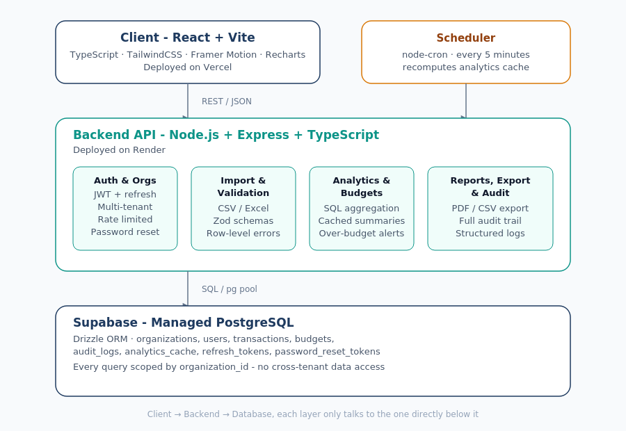
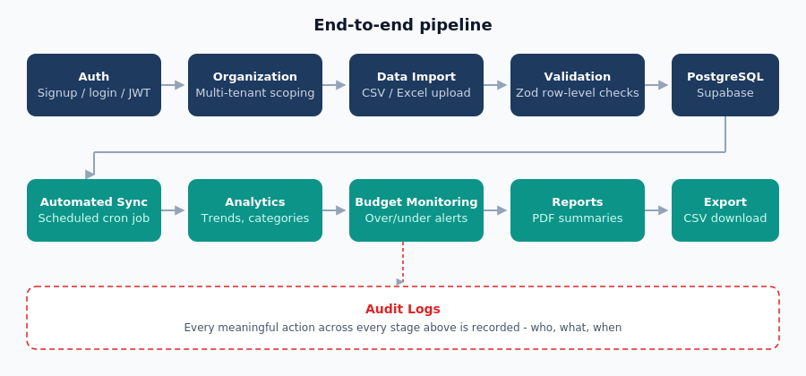
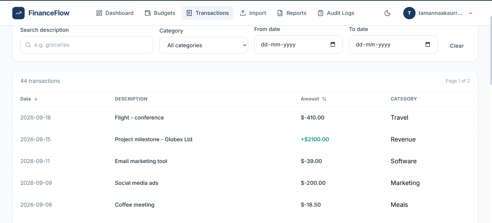

# FinanceFlow

**A multi-tenant financial reporting & analytics SaaS — built end to end, from database schema to production deployment.**

🔗 **Live demo:** [financeflow-one-cyan.vercel.app](https://financeflow-one-cyan.vercel.app)
🔑 **Demo login:** `financeflowdemo@gmail.com` / *(see "Try it yourself" below)*

---

## At a glance

| | | |
|---|---|---|
|  |  |  |
| *System architecture* | *End-to-end feature pipeline* | *The transactions screen, live* |

---

## What this is, and why I built it

FinanceFlow is a financial reporting and analytics tool for small businesses and freelancers — import your transactions, see where your money goes, set budgets, and catch overspending before it's a problem.

I built it to go deeper than a typical portfolio dashboard project. Instead of visualizing a static dataset, I wanted to build the **whole system a real SaaS product needs**: a proper multi-tenant database design, authenticated APIs, background automation, and the operational stuff that's easy to skip in a demo — rate limiting, audit logging, automated tests, and a real production deployment.

Every feature below was built, tested against a live database, and verified working before moving to the next — not just scaffolded and left half-finished.

## Try it yourself

The live demo uses a dedicated account (`financeflowdemo@gmail.com`) pre-loaded with realistic sample data, rather than my personal email — so you can explore signup, login, import, budgets, and reports without any setup. Credentials are available on request, or you're welcome to sign up your own account directly on the live site.

## Features

- **Authentication & multi-tenant organizations** — JWT-based auth with refresh token rotation; every user belongs to an organization, and every single query is scoped to that organization — one tenant can never see another's data, even by guessing IDs.
- **Data import & validation** — upload a CSV of transactions; each row is validated (dates, amounts, required fields) before saving, with a clear report of what imported and what was rejected and why.
- **Analytics dashboard** — income vs. expenses, spend-by-category breakdown, and month-over-month trends, backed by real SQL aggregation.
- **Budget monitoring** — set a monthly limit per category; the app compares it against actual spend and flags overruns.
- **Automated sync** — a scheduled background job recomputes and caches analytics on an interval, so the dashboard stays fast without recalculating on every request.
- **Transaction browser** — search, filter by category and date range, sort, and paginate through every imported transaction; edit or delete individual rows with full audit trail.
- **Recurring transaction tagging** — flag transactions as recurring, with a lightweight duplicate-detection hint suggesting likely candidates.
- **Reports & export** — generate a PDF summary report or export raw data as CSV.
- **Full audit trail** — every meaningful action (signups, imports, edits, deletes, budget changes, exports) is logged with who, what, and when.
- **Account recovery** — password reset and email verification with real email delivery.
- **Security hardening** — rate limiting on auth endpoints, file upload validation, revocable refresh tokens, security headers, structured error handling that never leaks internals.
- **Automated test suite** — integration tests covering auth, multi-tenant isolation, validation, budgets, and rate limiting, run against a real database.
- **Light & dark theme** — a custom fintech-style design system, fully responsive across desktop and mobile.

## Tech stack

**Frontend:** React, TypeScript, Vite, Tailwind CSS, Recharts, Framer Motion, lucide-react
**Backend:** Node.js, Express, TypeScript, Drizzle ORM
**Database:** PostgreSQL (Supabase)
**Infrastructure:** node-cron (scheduled jobs), Resend (transactional email), Vitest + Supertest (integration testing), Pino (structured logging), Helmet (security headers)
**Deployment:** Vercel (frontend) + Render (backend) + Supabase (database)

## Architecture

The client never talks to the database directly — every request goes through the Express API, which enforces organization-level access control before touching PostgreSQL. Scheduled jobs run inside the same backend service and write to the same audit trail as user-initiated actions.

See the architecture diagram above for the full layer breakdown.

## Security notes

- Passwords are hashed with bcrypt; refresh tokens are stored as SHA-256 hashes, never in plaintext.
- Every data-access query is filtered by `organization_id` server-side — this is enforced in the database query itself, not just in the UI.
- Auth endpoints are rate-limited (8 attempts / 15 minutes per IP) to resist brute-force attempts while staying usable for real users.
- CORS, cookie security flags, and trust-proxy settings are environment-aware — locked down appropriately in production, relaxed for local development.

## Known limitations (honestly stated)

- **Email delivery is currently restricted to the demo account.** The transactional email provider's free tier only delivers to a single verified address without a paid custom domain. In a real production deployment with a verified domain, this restriction goes away and any user could receive real reset/verification emails. I chose to document this rather than hide it — it's a cost tradeoff for a portfolio deployment, not a code limitation.
- **The free hosting tier sleeps after inactivity.** The backend may take 30–50 seconds to respond on the very first request after a period of no traffic. Subsequent requests are fast.
- **No automated CI/CD pipeline yet** — deployments are currently triggered by pushing to `main`; a proper staging environment and CI test gate would be the next step for a real production system.

## Project structure

```
FinanceFlow/
├── client/          React + Vite frontend
├── server/          Express + TypeScript API
│   ├── src/routes/  Auth, transactions, budgets, analytics, reports, audit logs
│   ├── src/db/      Drizzle schema, migrations, DB client
│   └── src/         Middleware: auth, rate limiting, observability
└── README.md
```

## Running it locally

```bash
git clone https://github.com/NareshParab/financeflow-saas.git
cd financeflow-saas
npm install
# Add your own DATABASE_URL, JWT secrets, and RESEND_API_KEY to server/.env
npm run dev
```

## What's next

- Verify a real custom domain to lift the email-delivery limitation for all users, not just the demo account
- Multi-user organizations with an invite flow (owner/admin/member roles already exist in the schema)
- CI pipeline running the test suite on every push

---

Built by [Naresh Parab](https://github.com/NareshParab) as a portfolio project demonstrating full-stack SaaS development — from schema design through production deployment.
